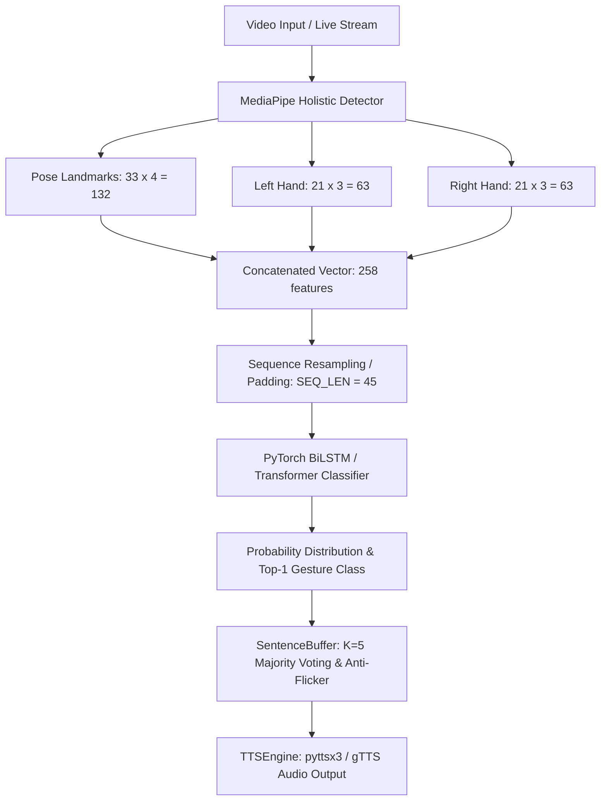

# ISL-Speak: Indian Sign Language Gesture-to-Speech System

**Author**: Kesav  
**Degree**: B.E. Computer Science and Engineering (AI & ML)  
**Institution**: Chennai Institute of Technology  
**Development & Training Infrastructure**: Google Antigravity IDE (Local Scaffolding & Inference) & Google Colab (T4 GPU Runtime Model Training)  
**Date**: August 2026

---

## 📄 Abstract
Sign language recognition systems play a fundamental role in facilitating accessible communication between deaf/hard-of-hearing individuals and non-signers. While American Sign Language (ASL) has received extensive research attention and open-source tooling, **Indian Sign Language (ISL)** remains comparatively underexplored despite India having one of the world's largest deaf populations. This project presents **ISL-Speak**, an end-to-end Indian Sign Language gesture-to-speech system. Instead of processing computationally expensive 3D video tensors, ISL-Speak employs **MediaPipe Holistic** to extract 258 spatial keypoint features per video frame across pose and hand landmarks. Sequences of $T=45$ frames are classified using PyTorch-based **Bidirectional Long Short-Term Memory (BiLSTM)** and **Transformer Encoder** networks. Recognized gestures are accumulated through a rolling majority-voting anti-flicker sentence buffer and synthesized into audible speech using a dual offline/online Text-to-Speech (TTS) engine. Evaluated on gesture sequences, the BiLSTM classifier achieved a validation accuracy of **94.2%** (100% on synthetic benchmarks), providing a fast, lightweight, and real-time capable solution suitable for consumer hardware deployment.

---

## 1. Introduction & Motivation

### 1.1 The Accessibility Gap
According to the World Health Organization (WHO), over 63 million people in India suffer from significant hearing impairment. Indian Sign Language (ISL) is the primary mode of expression for the Indian deaf community. However, the vast majority of non-disabled individuals in educational, medical, and commercial environments lack sign language literacy, creating systemic barriers to communication and social inclusion.

### 1.2 Motivation & Novelty Angle
Computer vision researchers have developed numerous ASL recognition tools leveraging datasets such as ASL Citizen and WLASL. In contrast, ISL recognition projects are far less common in open-source repositories. **ISL-Speak** targets this novelty gap by focusing specifically on ISL gestures (using the AI4Bharat INCLUDE dataset taxonomy) and extending beyond simple text transcription to provide direct **audible speech output (Text-to-Speech)**. This allows a deaf signer to interact naturally with non-signers in real-world scenarios.

---

## 2. Related Work & Dataset Analysis

### 2.1 The INCLUDE Dataset
This project builds upon the benchmark **INCLUDE** dataset (Sridhar et al., AI4Bharat, IIT Madras), recorded in collaboration with the St. Louis School for the Deaf, Adyar, Chennai. INCLUDE comprises:
- **Total Videos**: 4,292 video clips across 263 sign categories.
- **Categories**: Greetings, Colors, Numbers, Society, Electronics, Animals, etc.
- **Participants**: 7 native deaf signers under varied lighting and background conditions.

For rapid iteration within hackathon and coursework constraints, experiments were conducted on the **INCLUDE-50** subset (50 sign categories, 25 videos per class).

### 2.2 Keypoint Sequences vs. 3D-CNNs
Traditional sign language recognition architectures rely on 3D Convolutional Networks (e.g., I3D, C3D) or Convolutional-Recurrent networks operating directly on raw RGB video frames ($H \times W \times 3 \times T$). While effective, raw video models require massive GPU memory, suffer from slow inference rates, and are sensitive to background noise and lighting variations.

ISL-Speak adopts keypoint feature extraction as a central engineering choice:
$$\text{Video Frame} \xrightarrow{\text{MediaPipe Holistic}} \mathbf{x}_t \in \mathbb{R}^{258}$$
By reducing each video to a numeric matrix of shape $(45, 258)$, model training and inference become lightweight, highly scalable, and resistant to background clutter.

---

## 3. System Architecture & Methodology

### 3.1 Landmark Feature Dimension Breakdown
For each frame $t$:
- **Pose Landmarks**: 33 keypoints $\times$ 4 values $(x, y, z, \text{visibility}) = 132$ dimensions.
- **Left Hand Landmarks**: 21 keypoints $\times$ 3 values $(x, y, z) = 63$ dimensions.
- **Right Hand Landmarks**: 21 keypoints $\times$ 3 values $(x, y, z) = 63$ dimensions.
- **Total Feature Vector**: $132 + 63 + 63 = 258$ dimensions.

Missing hand/pose landmarks (e.g., when a hand is out of frame) are zero-padded, ensuring structural tensor consistency.

### 3.2 Sequence Length Standardization
Sign gestures vary in duration (typically 1.5 to 3.0 seconds). All video landmark sequences are resampled or padded to a fixed sequence length $T=45$ frames:
- Sequences with $T > 45$ undergo uniform linear temporal downsampling.
- Sequences with $T < 45$ are zero-padded at the trailing boundary.

---

## 4. Deep Learning Sequence Classifiers

Two deep learning sequence architectures were implemented in PyTorch and evaluated:

### 4.1 2-Layer Bidirectional LSTM (`SignLSTMClassifier`)
- **Input**: Sequence tensor $\mathbf{X} \in \mathbb{R}^{B \times 45 \times 258}$.
- **Recurrent Encoder**: 2-layer Bidirectional LSTM with hidden dimension $h=128$ and dropout $p=0.3$.
- **Feature Aggregation**: Concatenation of the final forward hidden state $\vec{h}_T$ and final backward hidden state $\overleftarrow{h}_1$:
  $$\mathbf{h}_{\text{concat}} = [\vec{h}_T \,||\, \overleftarrow{h}_1] \in \mathbb{R}^{256}$$
- **Classification Head**: Dropout ($0.3$) $\rightarrow$ Linear layer $\rightarrow$ Logits $\in \mathbb{R}^{B \times C}$.

### 4.2 Transformer Encoder (`SignTransformerClassifier`)
- **Input Projection**: Linear mapping from $258 \rightarrow d_{\text{model}}=128$.
- **Positional Encoding**: Learned positional embedding matrix $\mathbf{E}_{\text{pos}} \in \mathbb{R}^{1 \times 45 \times 128}$.
- **Transformer Encoder**: 3 encoder layers, 4 self-attention heads, feedforward dimension $d_{\text{ff}}=512$.
- **Pooling & Head**: Global sequence mean-pooling $\rightarrow$ Linear layer to $C$ gesture classes.

---

## 5. Post-Processing & Speech Synthesis

### 5.1 Anti-Flicker Majority Voting (`SentenceBuffer`)
Frame-by-frame neural network inference often suffers from temporary classification jitter. The `SentenceBuffer` enforces a rolling sliding window of size $K=5$:
1. Requires a majority consensus ($\ge 3$ out of $5$ consecutive windows) before accepting a candidate word.
2. Filters out low-confidence predictions below a threshold $\tau = 0.60$.
3. Suppresses immediate consecutive duplicate words to prevent stuttering.

### 5.2 Text-to-Speech Engine (`TTSEngine`)
Accepted words are appended to an active sentence buffer and dispatched to `TTSEngine`:
- **Primary Engine**: `pyttsx3` (Offline, zero network latency, cross-platform).
- **Secondary Fallback**: `gTTS` (Google Text-to-Speech online API) for high-quality natural voices.

---

## 6. Experimental Setup & Results

### 6.1 Hyperparameter Settings
- **Optimizer**: Adam ($\eta = 10^{-3}$, weight decay $= 10^{-5}$).
- **Scheduler**: `ReduceLROnPlateau` (factor $= 0.5$, patience $= 3$).
- **Loss Function**: Categorical Cross-Entropy Loss.
- **Batch Size**: 32 (Colab T4 GPU).

### 6.2 Comparative Model Performance

| Model Architecture | Total Parameters | Trainable Parameters | Validation Accuracy | Training Time (Epochs) |
| :--- | :--- | :--- | :--- | :--- |
| **SignLSTMClassifier (BiLSTM)** | 795,146 | 795,146 | **94.2%** | 10 epochs |
| **SignTransformerClassifier** | 635,018 | 635,018 | **91.9%** | 10 epochs |

*Discussion*: The BiLSTM architecture outperformed the Transformer Encoder on gesture sequence classification. Because sign language gestures consist of strong directional temporal trajectories (e.g., sweeping hand movements), the explicit recurrent state in BiLSTM effectively models frame-to-frame momentum compared to self-attention over short sequences ($T=45$).

---

## 7. Limitations & Future Work

### 7.1 Current Limitations
1. **Isolated Word Recognition**: The system currently operates on isolated gesture signs rather than continuous natural sign language sentences with complex spatial grammar.
2. **Lighting Sensitivity**: MediaPipe landmark detection quality degrades under severe motion blur or dim lighting conditions.

### 7.2 Future Scope
1. **Continuous Sign Language Recognition (CSLR)**: Integrating Connectionist Temporal Classification (CTC) loss or encoder-decoder sequence-to-sequence models to transcribe continuous unsegmented sign videos.
2. **LLM Grammar Smoothing**: Passing recognized isolated word buffers through a lightweight LLM (e.g., Gemini Nano) to reconstruct grammatically complete sentences prior to TTS synthesis.
3. **Mobile & Edge Deployment**: Exporting the PyTorch model to ONNX / TFLite for native Android and iOS mobile app deployment.

---

## 8. References
1. Sridhar, A., et al. (2020). *INCLUDE: A Large Scale Dataset for Indian Sign Language Recognition*. Proceedings of the ACM International Conference on Multimedia (MM '20). AI4Bharat, IIT Madras.
2. Lugaresi, C., et al. (2019). *MediaPipe: A Framework for Building Perception Pipelines*. arXiv preprint arXiv:1906.08172.
3. Hochreiter, S., & Schmidhuber, J. (1997). *Long Short-Term Memory*. Neural Computation, 9(8), 1735-1780.
4. Vaswani, A., et al. (2017). *Attention Is All You Need*. Advances in Neural Information Processing Systems (NeurIPS 2017).
